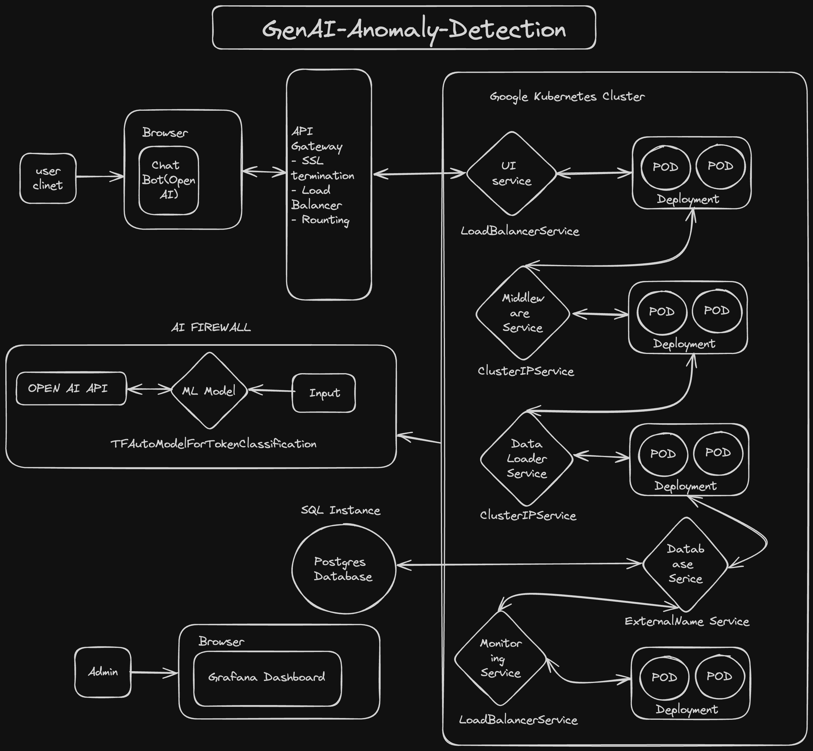

# GenAI Anomaly-Detection System

Welcome to the GenAI Anomaly-Detection System repository. This project is designed to enhance data security and user interaction by detecting sensitive information in user inputs and AI-generated responses. Built on a robust Google Kubernetes platform with Helm for efficient service deployment and management, it uses the TFAutoModelForTokenClassification for real-time anomaly detection.

Link to excalidraw - https://excalidraw.com/#json=QePiQ2uN7QHVwsWYiUkGn,UOe7ldv93jbiBw0sWA5d5Q

## Features

- **Real-time Anomaly Detection:** Utilizes machine learning to identify and block personal and location-specific data.
- **User and AI Response Filtering:** Screens both user inputs and AI responses for sensitive information.
- **Dynamic Monitoring:** Leverages Grafana for real-time monitoring and visualization of anomalies.
- **Secure Kubernetes Deployment:** Uses Helm to streamline Kubernetes deployments.

## Getting Started

These instructions will get you a copy of the project up and running on your local machine for development and testing purposes.

### Prerequisites

What things you need to install the software and how to install them:

    sudo apt update
    sudo apt install docker.io

### Installation

A step-by-step series of examples that tell you how to get a development environment running:

1. **Clone the repository**

    git clone https://github.com/PremkumarManoharan/GenAI-Anomaly-Detection.git
    cd genai-anomaly-detection

2. **Deploy with Helm**

    helm install my-genai ./helm/genai

3. **Configure Grafana**

    ## Instructions to set up Grafana for monitoring
    check services inside kubernetes cluster for IP address of grafana service.
    You can access the grafana using the IP for credential, use temp username password as admin and admin

## Contributing

We welcome contributions from the community. If you'd like to contribute, please fork the repository and use a pull request for your contributions. Please make sure to update tests as appropriate.

## License

This project is licensed under the MIT License - see the [LICENSE.md](LICENSE) file for details.
